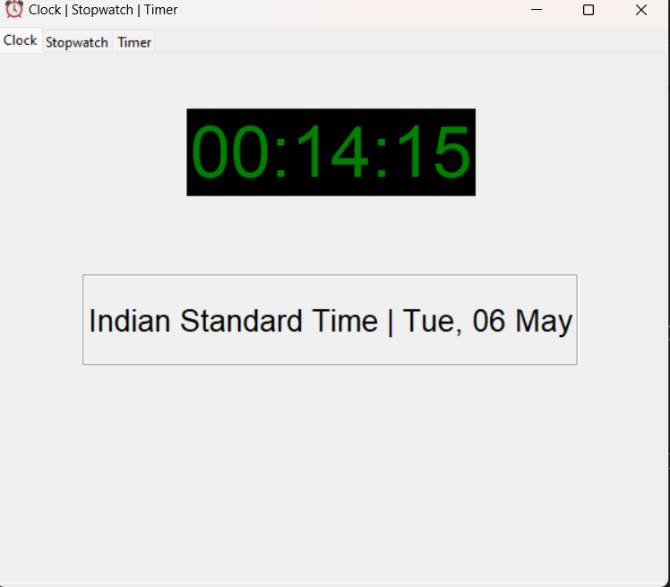
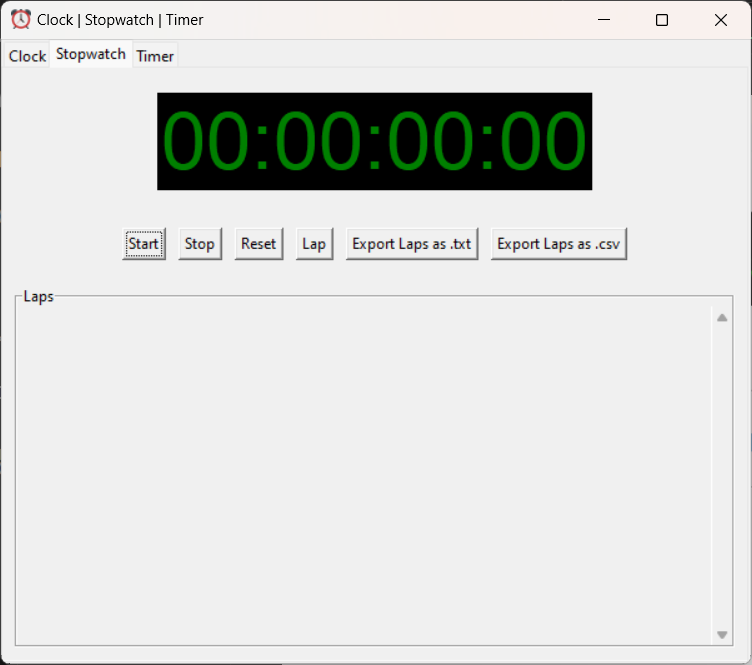
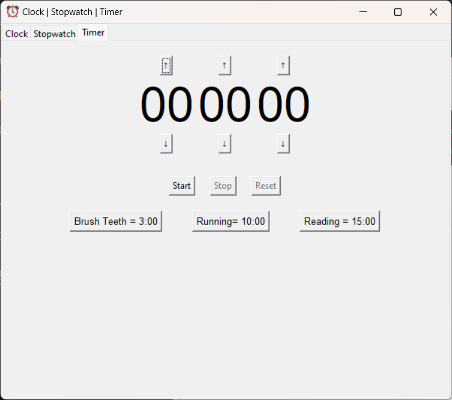

# 🕒 Stopwatch & Timer App

A simple yet powerful Python desktop app featuring a **Clock**, **Stopwatch**, and **Countdown Timer**, built using `Tkinter`. Includes sound notifications, lap-saving functionality, and native save dialogs. Perfect for productivity or time-tracking tasks.

---

## 🚀 Features

- **🕰️ Live Clock**  
  Always shows the current system time.

- **⏱️ Stopwatch**  
  - Start / Pause / Reset
  - Lap recording with timestamps
  - Save laps to `.txt` or `.csv` using native save dialog

- **⏳ Countdown Timer**  
  - Custom time input
  - Notification and sound alert on completion

- **🔊 Sound Alerts**  
  Built-in sound plays when a countdown finishes.

- **💾 Native File Save**  
  Windows-style file dialog to save lap records.

- **📦 Standalone EXE**  
  Built using `PyInstaller` so you can share the app easily without requiring Python installation.

---

## 📷 Screenshots
- ***Clock screenshot***



- ***StopWatch screenshot***



- ***Timer screenshot***



---

## 🛠️ Installation

### ✅ Requirements (for source code)

- Python 3.8 or above
- `playsound` library for sound notifications

Install with:

```bash
pip install playsound
```
---
## 🧱 Build Instructions (optional)
- To generate a .exe for Windows using PyInstaller:
```bash
pyinstaller --onefile --windowed your_script.py
```
- The .exe will be available inside the dist/ folder.
---
## 💾 How to Save Laps
- Use the stopwatch as needed.

- Click the “Save Laps” button.

- A native Windows Save dialog will appear.

- Choose .txt or .csv and click Save.
---
## 📦 Download the App
👉 Download latest release

- Share this link with others so they can use the app without installing Python.
---
## 🧑‍💻 Developer Info 
- Changes and improvements are tracked via commits and build versions.

- Feel free to fork and modify.

- All contributions welcome!
---
## 📝 License
This project is licensed under the MIT License.
Free to use, modify, and share!

***Made with ❤️ in Python using Tkinter***